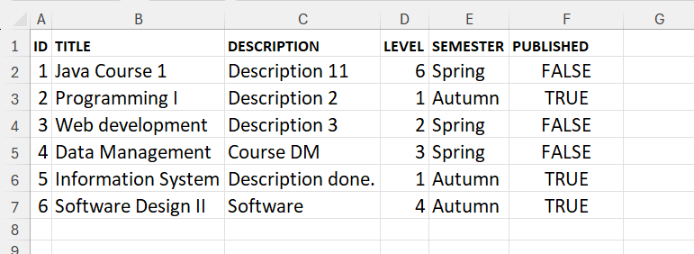
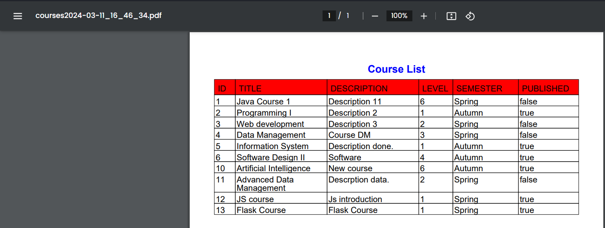

# 
# Course Management Web Application
<table>
<tr>
<td>
    SpringBoot Web application that holds courses data, using Spring MVC architecture.
</td>
</tr>
</table>

## Implementation
* Spring data JPA.
* CRUD operations.
* Object Relational Mapping (ORM).
* Lombok.
* Validations.
* Report Generation Excel / PDF through dependencies' usage.

---
## Site

### Courses Table.

### Adding a new course form.

### Editing an existing course form.

### Excel Report.

### PDF Report.

---
## Built with
- [Spring](https://spring.io/) - Frameworks for fast, secure and responsive web applications connected to any data storage.
- [Thymeleaf](https://www.thymeleaf.org/) - modern server-side Java template engine for both web and standalone environments.
- [Bootstrap](http://getbootstrap.com/) - Extensive list of components and  Bundled Javascript plugins.

## To-do
- Add Features as pagination, filtering, searching.

